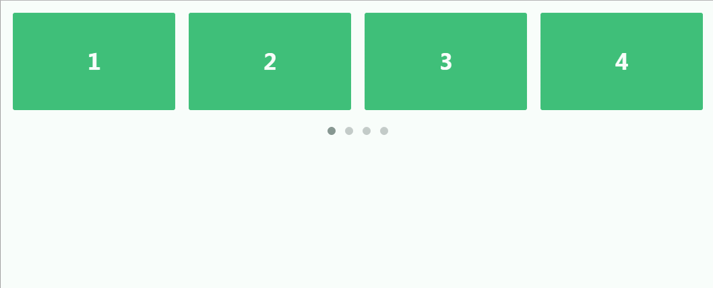

# jquery自适应轮播插件responCarousel

效果如下：


all code:
```
<!DOCTYPE html>
<html lang="en">
  <head>
    <meta charset="utf-8">
    <title>Owl Carousel</title>
    <meta name="viewport" content="width=device-width, initial-scale=1.0">
    <link rel="stylesheet" href="css/owl.carousel.css">
    <link rel="stylesheet" href="css/owl.theme.css">
    <link rel="stylesheet" href="css/index.css"/>
  </head>
  <body>
  <!--引入id名等于owl-demo  引入class名等于owl-carousel owl-theme-->
  <div id="owl-demo" class="owl-carousel owl-theme">
    <div class="item"><h1>1</h1></div>
    <div class="item"><h1>2</h1></div>
    <div class="item"><h1>3</h1></div>
    <div class="item"><h1>4</h1></div>
    <div class="item"><h1>5</h1></div>
    <div class="item"><h1>6</h1></div>
    <div class="item"><h1>7</h1></div>
    <div class="item"><h1>8</h1></div>
    <div class="item"><h1>9</h1></div>
    <div class="item"><h1>10</h1></div>
    <div class="item"><h1>11</h1></div>
    <div class="item"><h1>12</h1></div>
    <div class="item"><h1>13</h1></div>
    <div class="item"><h1>14</h1></div>
    <div class="item"><h1>15</h1></div>
    <div class="item"><h1>16</h1></div>
  </div>
    <script src="js/jquery-1.11.3.js"></script>
    <script src="js/owl.carousel.js"></script>
    <script>
      $(document).ready(function() {
        var owl = $("#owl-demo");
        owl.owlCarousel({
          items : 6,// 幻灯片每页可见个数
          itemsDesktop : [1198,4], //数组 [1199,4] 设置浏览器宽度和幻灯片可见个数，格式为[X,Y]，X 为浏览器宽度，Y 为可见数，如[1199,4]就是如果浏览器宽度 小于1199，每页显示 4 张，此参数主要用于响应式设计。也可以使用 false
          itemsDesktopSmall : [978,3], //  数组 [979,3] 同上（宽度小于978变成三个）
          itemsTablet: [768,2], //数组 [768,2] 同上（宽度小于768变成两个）
          itemsMobile : false // 数组 [479,1] 同上
        });
      });
    </script>
  </body>
</html>
```

